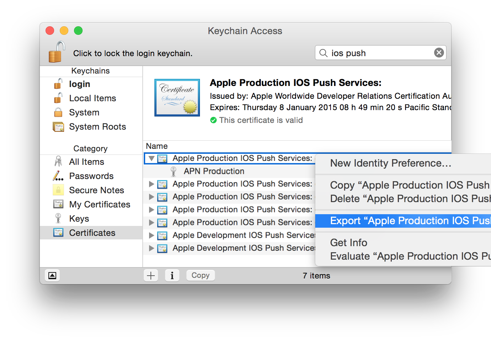
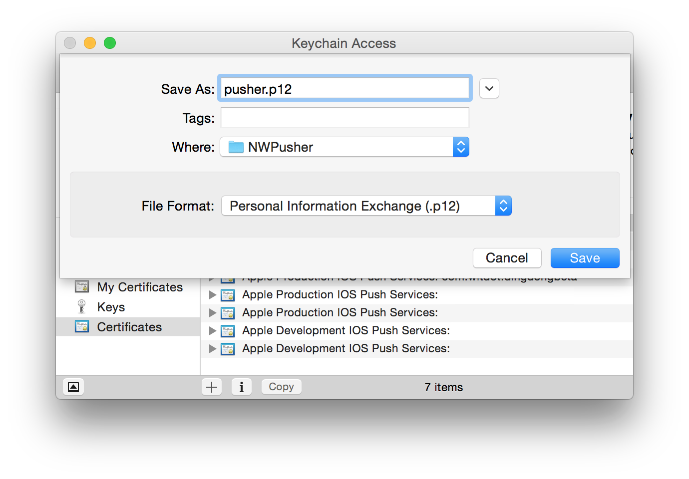
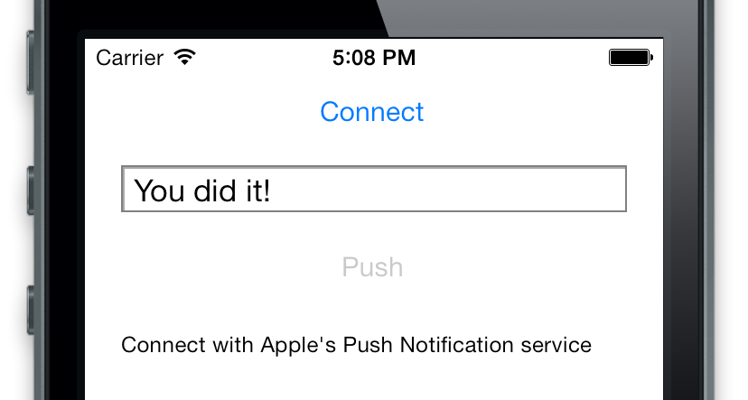

Pusher
======

*iOS/OS X application for playing with the Apple Push Notification Service.*

About
-----
Testing push notifications for your iOS app can be a pain. You might consider setting up your own server or use one of the many push webservices online. Either way it's a lot of work to get all these systems connected properly.

Enter *Pusher*, a Mac and iPhone app for sending push notifications *directly* to the *Apple Push Notification Service*. No need to set up a server or create an account online. You only need the SSL certificate and a device token to start pushing directly from your Mac, or even from an iPhone!

Pusher comes with a small library for both OS X and iOS, that provides various tools to send notifications programmatically. On OS X it can use the keychain to retrieve push certificates and keys. Pusher can also be used without keychain, using a PKCS12 file, e.g. when pushing from iOS.

Getting started
---------------
Before you can start sending push notification payloads, there are a few hurdles to take. First you'll need to obtain the *Apple Push Services SSL Certificate* of the app you want to send notifications to. This certificate is used by Pusher to set up the SSL connection through which the payloads will be sent to Apple.

Second you'll need the *device token* of the device you want to send your payload to. Every device has its own unique token that can only be obtained from within the app. While this might sound very complicated, it all comes down to just a few clicks on Apple's Dev Center website, some gray hairs, and a bit of patience.

### Certificate
Let's start with the SSL certificate. The goal is to get both the certificate *and* the private key into your OS X keychain. If someone else already generated this certificate, you'll need to ask him or her to export these into a PKCS12 file. If there is no certificate generated yet, you can generate the certificate and the private key in the following steps:

1. Log in to [Apple's Dev Center](https://developer.apple.com)
2. Go to the *Provisioning Portal* or *Certificates, Identifiers & Profiles*
3. Go to *Certificates* and create a *Apple Push Notification service SSL*
4. From here on you will be guided though the certificate generation process.

Keep in mind that you will eventually be downloading a certificate, which you will need to install in your keychain together with the private key. This should look something like this:

Both can be exported into a PKCS12 file, which allows you to share these with fellow developers:

### Device token
Now you need to obtain a device token, which is a 64 character hex string. This should be done from within the iOS app you're going to push to. Add the following lines to your application delegate:

    - (BOOL)application:(UIApplication *)application
        didFinishLaunchingWithOptions:(NSDictionary *)launchOptions
    {
        [UIApplication.sharedApplication  registerForRemoteNotificationTypes:
            UIRemoteNotificationTypeAlert | UIRemoteNotificationTypeBadge
            | UIRemoteNotificationTypeSound];
    }

    - (void)application:(UIApplication *)application
        didRegisterForRemoteNotificationsWithDeviceToken:(NSData *)token
    {
        NSLog(@"Device token: %@", [NWNotification hexFromData:token]);
    }

    - (void)application:(UIApplication *)application
        didFailToRegisterForRemoteNotificationsWithError:(NSError *)error
    {
        NSLog(@"Failed to get token: %@", error);
    }

    - (void)application:(UIApplication *)application
        didReceiveRemoteNotification:(NSDictionary *)notification
    {
        NSLog(@"Received push notification: %@", notification);
    }

Now, when you run the application, the 64 character push string will be logged to the console.

### Push from OS X
With the SSL certificate and private key in the keychain and the device token on the pasteboard, you're finally ready to send some push notifications. Let's start by sending a notification using the Pusher OS X app. Open the Pusher Xcode project and run the PusherMac target:

The combo box at the top lists the available SSL certificates in the keychain. Select the certificate you want to use and paste the device token of the device you're pushing to. The text field below shows the JSON formatted payload text that you're sending. Read more about this format in the Apple documentation under *Apple Push Notification Service*.

Now before you press *Push*, make sure the application you're *sending to* is in the *background*, e.g. by pressing the home button. This way you're sure the app is not going to interfere with the message, yet. Press push, wait a few seconds, and see.

If things are not working as expected, send me a message on GitHub or post an issue.

### Push from iOS
The ultimate experience is of course pushing from an iPhone to an iPhone, directly. This can be done with the Pusher iOS app. Before you run the PusherTouch target, make sure to include the *certificate, private key, and device token* inside the app. Take the PKCS12 file that you exported earlier and include it in the PusherTouch bundle. Then go to `NWAppDelegate.m` in the `Touch` folder and configure `pkcs12FileName`, `pkcs12Password`, and `deviceToken`. Now run the PusherTouch target:

If everything is set up correctly, you only need to *Connect* and *Push*. Then you should receive the *You did it!* push message on the device.

Again, if things are not working as expected, send me a message on GitHub or post an issue.

Pushing from source
-------------------
Pusher can also be used as a library to send notifications programmatically. The included Xcode project provides examples for both OS X and iOS. The easiest way include Pusher is by including all files from the `Library` folder:

 - NWPusher.h/m
 - NWNotification.h/m
 - NWSSLConnection.h/m
 - NWSecTools.h/m
 - ioSock.h/c

Next you need to link with `Foundation.framework` and `Security.framework`. Before any notification can be sent, you first need to create a connection. When this connections established, any number of payload can be sent.

*Note that Apple doesn't like it when you create a connection for every push.* Therefore be careful to reuse a connection as much as possible in order to prevent Apple from blocking.

To create a connection directly from a PKCS12 (.p12) file:

    NSURL *url = [NSBundle.mainBundle URLForResource:@"my-certificate.p12" withExtension:nil];
    NSData *pkcs12 = [NSData dataWithContentsOfURL:url];
    NWPusher *pusher = [[NWPusher alloc] init];
    NWPusherResult connected = [pusher connectWithPKCS12Data:pkcs12 password:@"pa$$word" sandbox:YES];
    if (connected == kNWPusherResultSuccess) {
        NSLog(@"Connected to APN");
    } else {
        NSLog(@"Unable to connect: %@", [NWPusher stringFromResult:connected]);
    }

When pusher is successfully connected, send a payload to your device:

    NSString *payload = @"{\"aps\":{\"alert\":\"You did it!\"}}";
    NSString *token = @"0123456789ABCDEF0123456789ABCDEF0123456789ABCDEF0123456789ABCDEF";
    NSUInteger identifier = rand();
    NWPusherResult pushed = [self pushPayload:payload token:token identifier:identifier];
    if (pushed == kNWPusherResultSuccess) {
        NSLog(@"Notification sending");
    } else {
        NSLog(@"Unable to sent: %@", [NWPusher stringFromResult:pushed]);
    }

After a second or so, we can take a look to see if the notification was accepted by Apple:

    NSUInteger identifier2 = 0;
    NWPusherResult accepted = [self fetchFailedIdentifier:&identifier2];
    if (accepted == kNWPusherResultSuccess) {
        NSLog(@"Notification sent successfully");
    } else {
        NSLog(@"Notification with identifier %i rejected: %@", (int)identifier2, [NWPusher stringFromResult:accepted]);
    }

Alternatively on OS X you can also use the keychain to obtain the SSL certificate. In that case first collect all certificates:

    NSArray *certificates = [NWSecTools keychainCertificates];

After selecting the right certificate, connect using:

    NWPusherResult connected = [pusher connectWithCertificateRef:certificate sandbox:YES];

More variations on this approach are available. Just take a look at the example project for the details.

Note that the example code above uses `sandbox:YES`. This means it's using development certificates and pushes to development apps. To push to production apps, set sandbox to `NO`.

Troubleshooting
---------------
Apple's Push Notification Service is not very forgiving in nature. If things are done in the wrong order or data is formatted incorrectly the service will refuse to deliver any notification, but generally provides few clues about went wrong and how to fix it. In the worst case, it simply disconnects without even notifying the client.

Some tips on what to look out for:

- A device token is unique to both the device, the developer's certificate, and to whether the app was built with a production or development certificate. Therefore make sure that the push certificate matches the app's provisioning profile exactly. This doesn't mean the tokens are always different; device tokens can be the same for different bundle identifiers.

- When an incorrect device token is used, Apple will close the connection without notifying the client. Unfortunately the client will be unaware of this until the next notification is sent. This can lead to confusing behavior where you might put the blame on the wrong device token. It's therefore important to only use device tokens that are guaranteed to come from within the app, using `application:didRegisterForRemoteNotificationsWithDeviceToken:`. Pusher does *not* automatically reconnect in such cases.

- There are two channels through which Apple responds to sent notifications: the notification connection and the feedback connection. Both operate asynchronously, so for example after the second push has been sent, we might get a response to the first push, saying it has an invalid payload. Use a new identifier for every notification so these responses can be linked to the right notification.

License
-------
Pusher is licensed under the terms of the BSD 2-Clause License, see the included LICENSE file.

Authors
-------
- [Noodlewerk](http://www.noodlewerk.com/)
- [Leonard van Driel](http://www.leonardvandriel.nl/)
